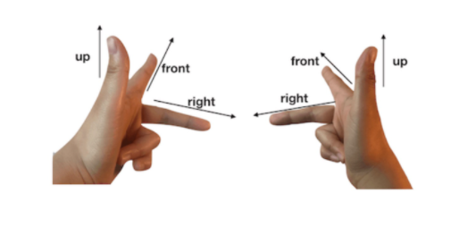

[TOC]

---

### canvas元素

```html
<canvas width="250" height="250" />
```

canvas元素上的 widht、height 属性不等同于它的css属性。这是因为css宽高的大小影响的是canvas在页面上呈现的大小，而html属性的大小是指canvas的坐标系大小。由此可以区分为画布宽高和样式宽高。

在没有指定html属性的情况下，canvas的画布宽高跟样式宽高相等。

因为画布宽高决定了可视区域的坐标范围，所以 Canvas 将画布宽高和样式宽高分开的做法，能更方便地适配不同的显示设备。


### canvas坐标系

左手坐标系。




### 绘制图形

具体分为两步：

* 获取Canvas上下文：
    * 获取canvas元
    * 素：`const canvas = document.getElementById('canvas')`
    * 获取2D上下文：`const context = canvas.getContext('2d')`;
* 利用上下文绘制，比如 `context.rect(width * 0.5, height * 0.5, 100, 100)`

### 中心坐标

上文绘制的矩形不在画布中间，如何调整？

* 第一种：计算，x、y减去自身宽高的一半。
* 画布平移转换：`context.translate(-0.5 * rw, -0.5 * rh)`

优缺点：

* 第一种，简单，但顶点多的时候，计算很麻烦
* 第二种，对画布做整体偏移，只需要计算左上角的顶点与中心的偏移；但这样就改变了画布的 **状态**。

那么如何恢复原来的状态？

* 反向平移；
* save 和 restore，用来暂存和恢复状态。


### 绘制层次关系图

 

### Canvas优缺点

* 优点：
    * Canvas是相对比较简单易用的指令式绘图系统；
    * Canvas具有出色的渲染能力，跟它所提供API更为底层有关；
* 缺点：对于html来说，canvas只是一个画布，它所绘制出来的图形对于浏览器来说也只是一个又一个的像素点，因此很难直接抽取出其中的图形对象进行操作（比如事件绑定）。


