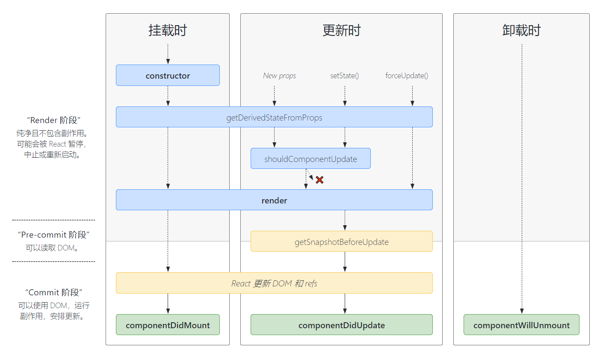
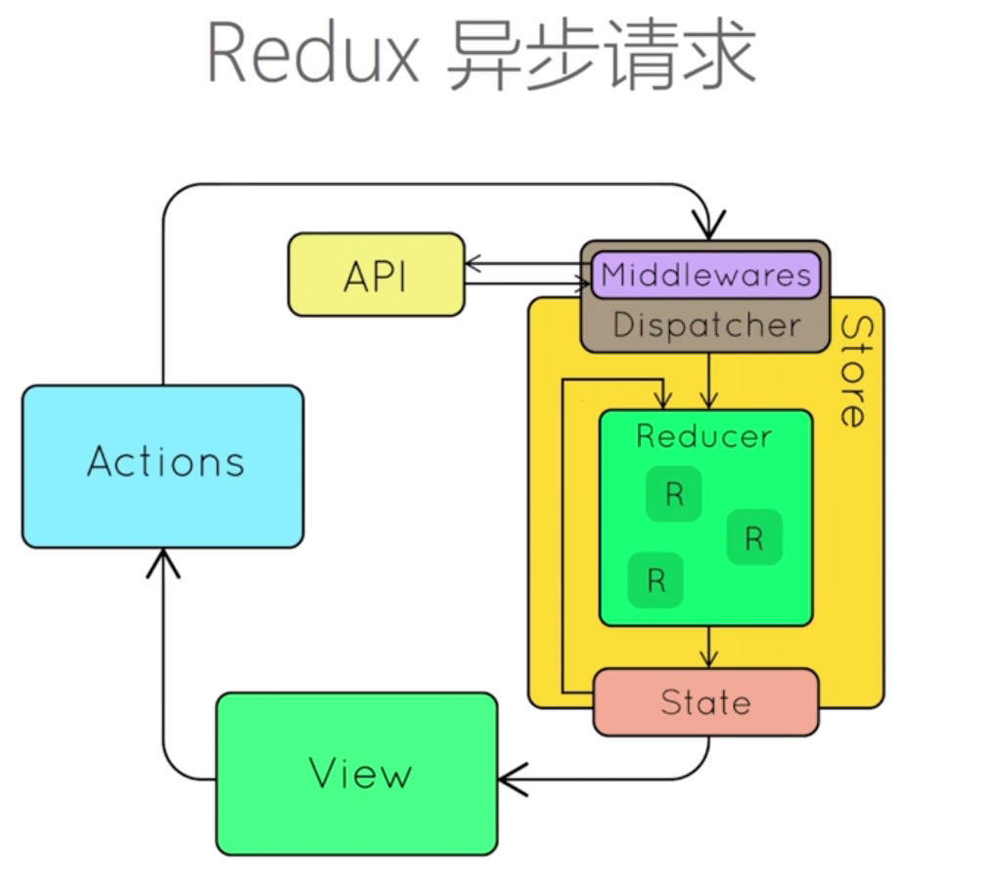

[TOC]

----


## 概览

### 以组件的方式考虑UI构建

* 将UI组织成组件树
* 单一职责
* DRY原则


### JSX

它不是模板引擎，而是 `React.createElement` 的语法糖。

在jsx中使用表达式时，明晰：

* 它自己是表达式

    ```jsx
    const element = <h1>hello world!</h1>
    ```

* 可以在属性中使用表达式

    ```jsx
    <MyComponent foo={1 + 2 + 3} />
    ```

* 可以延展属性

    ```jsx
    const props = { firstName: 'Ben', lastName: 'Hector' };
    const greeting = <Gretting { ...props } />
    ```

* 表达式作为子属性

    ```jsx
    const element = <li>{ props.message }</li>
    ```

约定：自定义组件以 **大写字母开头**。

* React认为小写的tag是原生的dom节点，比如div
* 大写字母开头为自定义组件
* JSX可以直接使用属性语法，比如 `<menu.Item />`


### 生命周期方法及其应用场景

如下图，react的生命周期分为三个阶段、三种类型的运行时：

* 三阶段：
    * Render阶段：纯净且没有副作用，可能被React暂停或终止。
    * Pre-commit阶段：可以**读取**DOM（DOM对象构建完成）。
    * Commit阶段：可以**使用**DOM（DOM更新到视图上了），可以运行副作用，安排更新。
* 三类型：
    * 挂载时
    * 更新时
    * 卸载时




#### constructor

```react
constructor(props) {
    // 在为 React.Component 子类实现构造函数时,应在其他语句之前前调用 super(props)。
    // 否则，this.props 在构造函数中可能会出现未定义的 bug。
 	super(props);
  	// 不要在这里调用 this.setState()
    this.state = { counter: 0 };
    this.handleClick = this.handleClick.bind(this);
}
```

该构造函数仅用于以下两种情况：

* 通过给 `this.state` 赋值对象来初始化内部state：`this.state = { test: 123 }`；

* 为事件处理函数绑定实例；

    

#### getDerivedStateFromProps

```react
static getDerivedStateFromProps(props, state)
```

`getDerivedStateFromProps` 会在每次调用 render 方法之前调用，并且在初始挂载及后续更新时都会被调用。它应返回一个对象来更新 state，如果返回 `null` 则不更新任何内容。

* 当state需要从props初始化时使用；
* 典型场景：表单控件获取默认值。


#### shouldComponentUpdate

```react
shouldComponentUpdate(nextProps, nextState)
```

当 `props` 或 `state` 发生变化时，`shouldComponentUpdate` 会在渲染执行之前被调用。返回值默认为 `true`。

**首次渲染或使用 `forceUpdate()` 时不会调用该方法。**

* 决定Virtual DOM是否重绘（返回值）
* 一般由PureComponent自动实现
* 典型场景：性能优化。


#### getSnapshotBeforeUpdate

```react
getSnapshotBeforeUpdate(prevProps, prevState)
```

`getSnapshotBeforeUpdate()` 在最近一次渲染输出（提交到 DOM 节点）之前调用。它使得组件能在发生更改之前从 DOM 中捕获一些信息（例如，滚动位置）。此生命周期的**任何返回值**将作为**参数传递**给 `componentDidUpdate()`。

* 在页面render之前调用，state已经更新。
* 典型场景：获取render之前的DOM状态。


#### componentDidMount

```react
componentDidMount()
```

`componentDidMount()` 会在组件挂载后（插入 DOM 树中）立即调用。依赖于 DOM 节点的初始化应该放在这里。

* UI渲染完成后调用；

* 只调用一次；

* 典型场景：获取外部资源（比如实例化请求）。

    

#### componentWillUnmount

```react
componentWillUnmount()
```

`componentWillUnmount()` 会在组件卸载及销毁之前直接调用。在此方法中执行必要的清理操作（**资源释放**），例如，清除 timer，取消网络请求或清除在 `componentDidMount()` 中创建的订阅等。


#### componentDidUpdate

```react
componentDidUpdate(prevProps, prevState, snapshot)
```

会在更新后会被立即调用。**首次渲染不会执行此方法。**

* 可以对dom进行操作
* 典型场景：需要根据props变化重新获取数据。


### Virtual DOM 及 key属性的作用

改进后的diff算法：广度同层比较（O(n)）。

vm的两个假设：

* 组件的dom结构是相对稳定的
* 类型相同的兄弟节点可以被**唯一标识**（key，高性能比较）。


### 组件设计模式

> 高阶组件和函数作为子组件。
>
> 高阶组件接收组件作为参数，返回新的组件。


### Context API 及其使用场景

> Context API，用于解决组件间通信问题。


### 脚手架

* create-react-app
* Rekit
* codesandbox 


## React生态圈

### Redux


#### 特性

* Single Source of Truth：单一数据源

    整个应用的state被存储在一个 `Object Tree`中，并且这个 object tree只存在于唯一一个 `store` 中。

* 可预测（state是只读的）

    唯一改变state的方法就是触发 `action`，action是一个用于描述**已发生**事件的普通对象。

* 使用纯函数来执行修改。

    为了描述action如何修改state tree，需要编写reducer。reducer是接收先前state、action 和 返回 新的state的**纯函数**（输出结果完全依赖于输入参数）。

#### 核心概念


##### store

```js
const store = createStore(reducer);
```

* `getState()`
* `dispatch(action)`
* `subscribe(listener)`

##### action

```js
{
    type: ADD_TODO,
    text: 'Build my first redux app'
}
```

* `bindActionCreator`

##### reducer

```js
function todoApp(state = initialState, action) {
    switch (action.type) {
    	case: ADD_TODO:
            return Object.assign({}, state, {
                todos: [
                    ...state.todos,
                    {
                        text: action.text,
                        completed: false
                    }
                ]
            });
            
         default:
            return state;
    }
}
```

多个reducer的情况下，可以使用 `combineReducers`进行合并。


#### react-redux

`connect`：一个高阶组件，`connect(mapStateToProps, mapDispatchToProps)(MyComponent)`。

```react
import React from "react";
import { bindActionCreators, createStore } from "redux";
import { Provider, connect } from "react-redux";

function mapStateToProps (state) {
    return {
        count: state.count
    }
}
function mapDispatchToProps (dispatch) {
    return bindActionCreators({ minusOne, plusOne }, dispatch);
}

const ConnectedCounter = connect(mapStateToProps, mapDispatchToProps)(Counter);

export default class CounterSample extends React.Component {
    render () {
        return (
        	<Provider store={ store }>
            	<ConnectedCounter />
            </Provider>
        );
    }
}
```


#### 异步action及redux中间件




异步action：

* 异步action不是特殊的action，而是多个同步action的组合使用；
* 中间件在dispatcher中，截获action做特殊处理。

redux中间件（redux-middleware）：返回`promise`。

* 截获action

* 发出action

    

#### 组织action和reducer

单个action、reducer文件组织在一块。


#### 不可变数据（immutable data）

> redux运行的基础。

* 不可直接修改值，而是通过产生新对象赋值的形式得到新的数据。
* 好处：
    * 性能优化（比较引用即可，无需遍历）
    * 易于调试和跟踪（新旧值）
    * 易于推测（state变化只能通过action触发，那么相应变化可以推断出是由哪个action触发的）
* 如何操作不可变数据
    * `{...}` | `Object.assign()`
    * `immutability-helper`
    * `immer`

### React Router

为什么需要路由：

* 单页应用需要进行页面切换
* 通过url可以定位到页面
* 更有语义的资源组织

#### 特性

* 声明式路由定义
* 动态路由

#### 三种实现方式

* URL路径
* hash路由
* 内存路由

#### 好处

基于路由配置进行资源组织：

* 实现业务逻辑的松耦合
* 易于扩展、重构和维护
* 路由层面实现 Lazy Load

#### 常用API

* <Link>：普通链接，不会触发浏览器刷新

    ```react
    import { Link } from 'react-router-dom';
    
    <Link to="/about">About</Link>
    ```

* <NavLink>：类似Link，但可以添加当前选中状态

    ```react
    <NavLink to="fqa" activeClassName="active">FAQ</NavLink>
    ```

* <Prompt>：满足条件时，询问用户是否确定离开当前页面

    ```react
    import { Prompt } from 'react-router';
    
    <Prompt when={ formiSHalfFilledOut } message="to leave?" />
    ```

* <Redirect>：重定向当前页面，例如登录判断

    ```react
    import { Route, Redirect } from 'react-router';
    
    <Route exact path='/' render={ () => (
        loggedIn ? (
        	<Redirect to="dashboard" />
        ) : (
        	<PublicHomePage />
        )
     ) } />
    ```

    

* <Router>：路由配置的核心标记，路径匹配时显示相应的组件。（并不排他，匹配到多个route，那么会显示多个component）

    ```react
    import { BrowserRouter as Router, Route } from 'react-router-dom';
    
    <Router>
    	<div>
        	<Route exact path="/" component={ Home } />
            <Route path="news" component={ News } />
        </div>
    </Router>
    ```

* <Switch>：只显示第一个匹配的路由。

    ````react
    import { Switch, Route } from 'react-router';
    
    <Switch>
    	<Route exact path="/" component={ Home } />
        <Route path="news" component={ News } />
        <Route component={ NonMatch } />
    </Switch>
    ````


> `react-router` 和 `react-router-dom` 的区别：
>
> `*-dom` 依赖于 `react-router`，同时加入了浏览器环境下的一些功能，比如 `Link` 标签会渲染 `a` 标签。同理，`*-native`则是加入了 `react-native` 环境下的一些功能。/
>
> 在开发时，如果是浏览器环境，直接安装 `react-router-dom` 即可。


#### 参数传递

* 传参：`<Route path="/topic/:id" component={ Topic } />`
* 获取：`this.props.match.params`

#### 路由嵌套

* 每个react组件都可以是路由容器；
* 嵌套的路径必须包含上级路径；


### UI组件库对比

* Ant Design：主要用于研发企业级中后台产品
* Material UI：更偏向消费者。

**选择UI库的因素**：

* 组件库是否齐全

* 样式风格是否符合业务需求

* API设计是否便捷灵活

* 技术支持是否完善：文档、issue处理情况

* 开发是否活跃

    

### Next.js开发同构应用

> 第一次请求是由服务器渲染返回，浏览器直接呈现；后续操作均在浏览器实现，表现为一个单页面应用。


### 使用Jest、Enzyme等工具进行单元测试

React让前端单元测试变得简单：

* react应用很少访问浏览器API
* 虚拟dom可以在node环境中运行和测试
* Redux隔离了状态管理，可以进行纯数据层单元测试

涉及到的工具：

* Jest：fb开源的js单元测试框架爱

* JS DOM：Nodejs模拟浏览器环境

* Enzyme：React组件渲染和测试

* nock：模拟http请求

* sinon：函数模拟和调用跟踪

* Istanbul：单元测试覆盖率

    

### 常用开发调试工具


#### Eslint

使用 `.eslintrc` 进行规则的配置

一般可以通过 `extend` 使用社区流行规定，比如 `Airbnb`。

`autoFixOnSave` 开启可自动修复。

#### Prettier

代码格式化工具，`.prettierrc`。

#### React Dev Tools

观察组件结构。

#### Redux Dev Tools

调试redux应用。


## 构建可维护可拓展的前端应用


### 前端项目的理想结构


* 易于开发
    * 开发工具是否完善
    * 生态圈是否繁荣
    * 社区是否活跃
* 易于拓展
    * 增加新功能是否容易
    * 新功能是否会显著增加系统复杂性
* 易于维护
    * 代码是否容易理解
    * 文档是否健全
* 易于测试
    * 功能的分层是否清晰（视图、数据）
    * 副作用少（功能模块高内聚，对外部依赖少）
    * 尽量使用纯函数（输入确定，输出确定）
* 易于构建
    * 使用通用技术和架构
    * 构建工具的选择


### 拆分复杂度 -- 领域模型

> 按领域模型（feature）组织代码，降低复杂度

将某个feature所需的 component、action、reducer组织在一起。


#### 拆分component、action和reducer

* feature组织 component、action 和 reducer

* 按feature组织 component、action 和 reducer
* 使用 root loader 加载 feature 下的各个资源

比如组件：


比如action、reducer：


#### 拆分路由配置


使用JSON定义顶层路由，比如：

```react
import { WelcomePage, CounterPage, Layout } from './';

export default {
    path: 'example',
    name: 'example',
    component: Layout,
    childRoutes: [
        { path: '', name: 'Welcome Page', component: WelcomePage },
        { path: 'counter', name: 'Counter Page', component: CounterPage },
    ]
}
```

然后通过配置渲染出相应的路由组件：

```react
function renderRouteConfig() {
    
}
```


### 使用Rekit


## 常见场景及其最佳实践

### 登录授权

使用React Router管理路由授权：

* 实现基础：React Router的动态路由机制
* 区分受保护路由和空开路由
* 访问未授权路由时重定向到登录页面