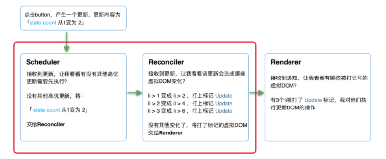

[TOC]


### React16架构

分为三层：

* 调度器（Scheduler）：调度任务的优先级，高优任务优先进入Reconciler。
* 协调器（Reconciler）：负责找出变化的组件
* 渲染器（Renderer）：负责将变化更新到DOM中

同React15相比，多出了协调器Scheduler。


### Scheduler

可中断异步更新使用到浏览器的空闲时间，那么就需要一种机制，用于在浏览器空闲时通知。

浏览器自身的 `requestIdleCallback`可以满足这个需求，但存在兼容性等问题。因此React实现了更为完备的Polyfill，`Scheduler`。


### Reconciler

> 内部使用了`Fiber`的架构。

新的Reconfiler，将原来的递归操作，转变为可以中断的循环过程，每次循环都会判断当前是否有剩余时间：

```js
// noonline
function workLoopConcurrent () {
  // perform work until Scheduler asks us to yield
  while (workInProgress !== null && !shouldYield()) {
    workInProgress = performUnitOfWork(workInProgress);
  }
}
```

同时，Reconfiler和Renderer不再是交替工作，Scheduler将任务交给Reconciler之后，Reconciler为变化的虚拟DOM打上新增/删除/更新等标记。

Scheduler和Reconfiler的工作过程在内存中完成，当所有组件都完成Reconfiler的工作后，统一交给Renderer。


### Renderer

根据Reconfiler为虚拟DOM打上的标记，同步执行对应的DOM操作。



中间红色框的部分可以被终端，原因可能是：

* 有其他更高优先级的任务需要更新
* 当前帧没有剩余时间。