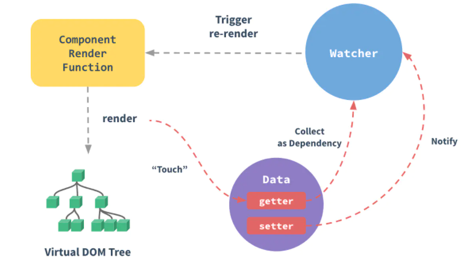

[TOC]


### 响应式原理

Vuejs使用 `Object.defineProperty`实现响应式。

在实例化的过程中，对数据进行**劫持**，生成 `getter` 和 `setter`；

在模板编译的过程中，实例化 `Watcher`对象，传入组件更新回调，进行依赖收集；

数据项更新时，触发 `setter`，`setter`进行依赖分发，通知watcher执行更新回调。



​	 

* defineReactive: getter/setter
* Compiler: render
* Watcher: re-render trriger
* Dep: collect / notify


### Object.defineProperty缺陷

Object.defineProperty不能监听 **数组下标的变化** 和 **数组引用不变的情况**。

对于第一个问题，vue提供了 `$set(obj, key, val)` API，在内部判断传入对象是否为数组，在为数组的情况下使用重写的 `splice`方法修改下标对应值，从而进行依赖收集。

````JavaScript
export function set (target: Array<any> | Object, key: any, val: any): any {
      // 判断是否为数组且下标是否有效
      if (Array.isArray(target) && isValidArrayIndex(key)) {
        // 调用 splice 函数触发派发更新
        // 该函数已被重写
        target.length = Math.max(target.length, key)
        target.splice(key, 1, val)
        return val
      }
      // 判断 key 是否已经存在
      if (key in target && !(key in Object.prototype)) {
        target[key] = val
        return val
      }
      const ob = (target: any).__ob__
      // 如果对象不是响应式对象，就赋值返回
      if (!ob) {
        target[key] = val
        return val
      }
      // 进行双向绑定
      defineReactive(ob.value, key, val)
      // 手动派发更新
      ob.dep.notify()
      return val
}
````


对于第二个问题，vue重写了 `'push',  'pop',  'shift',  'unshift',  'splice',  'sort',  'reverse'` 等方法，在方法内部进行**依赖收集**和**手动派发更新**。

```JavaScript
// 获得数组原型
const arrayProto = Array.prototype
export const arrayMethods = Object.create(arrayProto)
// 重写以下函数
const methodsToPatch = [
	'push',
    'pop',
    'shift',
    'unshift',
    'splice',
    'sort',
    'reverse'
]
methodsToPatch.forEach(function (method) {
	// 缓存原生函数
    const original = arrayProto[method]
    // 重写函数
    def(arrayMethods, method, function mutator (...args) {
        // 先调用原生函数获得结果
        const result = original.apply(this, args)
        const ob = this.__ob__
        let inserted
        // 调用以下几个函数时，监听新数据
        switch (method) {
            case 'push':
            case 'unshift':
                inserted = args
                break
            case 'splice':
                inserted = args.slice(2)
                break
        }
        if (inserted) ob.observeArray(inserted)
        // 手动派发更新
        ob.dep.notify()
        return result
    })
})
```


### nextTick原理分析

`nextTick`提供了将回调延迟到下次DOM更新之后执行的方法。

`nextTick`函数做两件事：第一是生成一个timeFunc函数，参与到**事件循环**中；二是将回调函数放入**回调队列**，等待合适时机执行。

内部实现timeFunc时，依次尝试使用原生的 `Promise.then`、`MutationObserver` 和 `setImmediate`，如果执行环境不支持，就会使用 `setTimeout(fn, 0)`。

队列中的回调函数分为两种：视图更新回调 和 开发者通过 `this.$nextTicn(func)`传入的回调。

**合适时机** 具体要看 timeFunc的实现，如果是  `Promise.then`、`MutationObserver`这种微任务（microTask），则是在本次Tick尾部执行[1]；如果是 `setImmediate` 和 `setTimeout(fn, 0)`这种宏任务，则是在下一次Tick中执行。（如果是宏任务，因为js引擎线程和UI渲染线程共用同一线程，还需要等待UI渲染完毕才能执行，这势必影响性能。）

> [1] 微任务中的回调取值，实际上是取DOM对象中的值，只是此时DOM对象还没有渲染出来而已。
>
> MutationObserver提供了监听dom树改变的能力。实例化时，传入回调函数（微任务)返回一个观察器，观察器调用方法 `observer`，传入监听的dom节点和配置选项（需要观察什么变动：属性、子节点等）。

### 异步更新原理

Vue对DOM的更新是异步执行的。当数据发生改变时，对应watcher执行update方法，判断自身是否在异步队列中，如果不在则通过 `nextTick()` 将自身推入，这样可以避免不必要的计算和dom操作。然后在事件循环尾部或者下一个事件循环Tick中，vue刷新队列，执行其中回调，从而达到异步更新的目的。


### Virtual DOM

#### 创建


