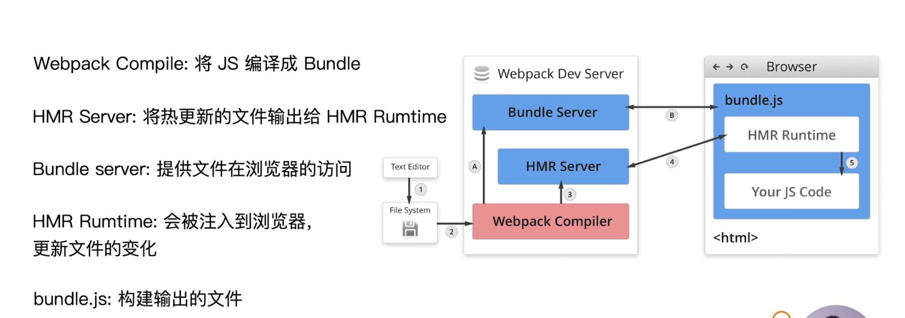
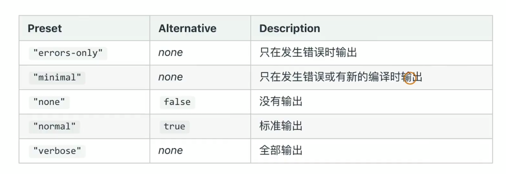
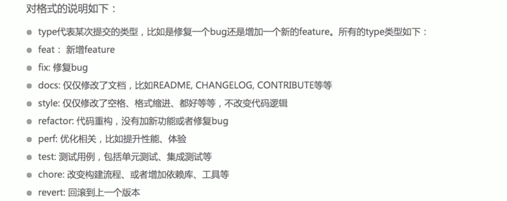

[TOC]

### 1. 为什么需要构建工具

* 转换ES语法
* css 预处理
* 压缩混淆
* 图片压缩

### 2. 前端构建演变之路

* YUI Dev tools
* grunt
* gulp
* webpack、rollup、parcel

### 3. 为什么选择webpack

* 社区生态繁荣
* 配置灵活、插件化拓展
* 更新迭代速度快

### 4. 初识webpack

* 配置化：

    * webpack.config.js
    * webpack --config xxx.js

* 配置组成

    * 入口：entry

    * 输出：output

    * loader配置

        ```javascript
        ...
        module: {
            rules: [
                { test: '/\.txt$/', use: 'raw-loader' }
            ]
        }
        ...
        ```

    * plugins配置

        ```javascript
        ...
        plugins: [
            new HtmlwebpackPlugin({
                template: './src/index.html'
            })
        ]
        ...
        ```


### 4. 核心概念 -- entry

> 打包入口

* 单入口

    * 字符串

    ```javascript
    module.exports = {
        entry: './path/to/my/entry/file.js'
    }
    ```

    

* 多入口

    * 对象

    ```JavaScript
    module.exports = {
        entry: {
            app: './src/app.js',
            adminApp: './src/adminApp.js'
        }
    }
    ```

    

### 5. 核心概念 -- output

* 单入口

    ```javascript
    module.exports = {
        entry: '/path/to/my/entry/file.js',
        output: {
            filename: 'bundle.js',
            path: __dirname + '/dist'
        }
    }
    ```

    

* 多入口

    ```javascript
    module.exports = {
        entry: {
            app: '/path/app.js',
            adminApp: '/path/adminApp.js'
        },
        output: {
            filename: '[name].js', 	// 通过占位符确保文件名称唯一
            path: __dirname + '/dist'
        }
    }
    ```

    

### 6. 核心概念 -- loader

> webpack 开箱即用只支持js和json两种文件类型，需要通过loader将其他类型转换为有效的模块，从而可以添加到依赖图中。
>
> loader本身是一个函数，接收源文件作为参数，返回转换的结果。

```javascript
module.exports = {
    ...
    module: {
        rules: [
            { test: '/\.txt$/', use: 'raw-loader' }
        ]
    }
}
```

* test: 指定匹配规则
* use：指定使用的 loader 名称

### 7. 核心概念 -- plugins

> 插件用于 **bundle文件的优化**、**资源管理** 和 **环境变量** 的注入。
>
> 作用于整个构建过程。

常见的plugins：

| 名称                     | 描述                                       |
| ------------------------ | ------------------------------------------ |
| CommonsChunkPlugin       | 将chunks相同的模块代码提取成公共js         |
| CleanWebpackPlugin       | 清理构建目录                               |
| ExtractTextWebpackPlugin | 将css从bundle文件中提取成一个独立的css文件 |
| CopyWebpackPlugin        | 将文件或者文件夹拷贝到构建的输出目录       |
| HTMLWebpackPlugin        | 创建html文件去承载输出的bundle             |
| UglifyjsWebpackPlugin    | 压缩js                                     |


### 8. 核心概念 -- mode

> 用来指定当前的构建环境：production、development、none。
>
> 设置 mode 可以使用 webpack 内置的函数，决定是否开启优化选项，默认值为 production

* development
    * 设置 `process.env.NODE_ENV` 的值为 `development`
    * 开启 `NamedChunksPlugin` 、`NamedModulePlugin`
* production
    * 设置 `process.env.NODE_ENV` 的值为 `production`
    * 开启 ... 等插件
* none
    * 不开启任何优化选项。

### 9. 资源解析

#### 9.1 解析ES6

#### 9.2 解析jsx

#### 9.3 解析css

* `style-loader`
* `css-loader`
* `scss-loader`

#### 9.4 解析图片和字体

`file-loader`


### 10. 文件监听

> 文件监听是在发现源码发生变化时，自动构建出新的输出文件。

* webpack开启监听模式，有两种方式：
    * 启动webpack命令时，带上 `--watch` 参数
    * 配置文件 `webpack.config.js` 中设置参数 `watch: true`

* 缺陷：需要手动刷新浏览器。

* 文件监听的原理：

    * **轮询** 判断文件的最后编辑时间是否发生变化
    * 某个文件发生变化时，不会立即告诉监听者，而是先缓存起来，等 `aggregateTimeout`

    ```JavaScript
    module.exports = {
        // 默认不开启，即为 false
        wathch: true,
        // watch 为true，watchOptions 才有意义
        watchOptions: {
            // 不监听的文件或者文件夹，支持正则，默认为空
            ignored: /node_moduel/,
            // 实施延迟，默认300ms
            aggregateTimeout: 300ms,
            // 判断文件变化时通过不停访问系统文件是否有变化，默认每秒 1000 次
            poll: 1000
        }
    }
    ```

    

 

### 11. 热更新

#### 11.1 热更新方式

* `webpack-dev-server`

    * `--open` 自动打开参数
    * wds不刷新浏览器
    * 不输出文件，而是放在内存中，无IO，构建速度更快。
    * 使用 `HotModuleReplacementPlugin` 插件

* `webpack-dev-middleware`

    * 配合 `express` 或者 `koa`

        ```JavaScript
        const express = require('express');
        const webpakc = require('webpack');
        const webpackDevMiddleware = require('webpack-dev-middleware');
        
        const app = express();
        const config = require('./webpack.config.js');
        const compiler = webpack(config);
        
        app.use(webpackDevMiddleware(compiler, {
            publickPath: config.output.publickPath
        }));
        
        app.listen(3000, () => {
            ...
        });
        ```

    * wdm 将webpack的输出文件传输给服务器，使用与灵活的定制场景

    

#### 11.2 原理分析

    


​    

热更新分为两个阶段：启动阶段 和 开发阶段

* 启动阶段：初始代码通过webpack compiler进行打包，推送到同在服务端的 Bundle Server，，让浏览器可以访问得到。
* 开发阶段：文件发生改变时，代码仍会经过 webpack compiler进行编译打包，但此时是推送到同在服务端的HMR Server，让其知晓哪些内容发生变化，HMR Server再通知被注入到浏览器中的HMR Runtime（通常是通过 websocket通信），使用 json格式传输数据，最后是由HMR Runtime 更新浏览器端数据。


### 12. 文件指纹

* 种类
    * Hash
        * 和整个项目有关，只要项目文件有修改，**整个项目**构建的hash都会改变。
    * ChunkHash
        * 和 webpack 打包的 chunk（打包好的模块） 有关，不同的 entry 会生成不同的chunkhash。
    * ContentHash
        * 根据文件内容来定义hash，文件内容不变，则contentHash不变。


### 13. html/css/js压缩

* js 压缩

    * 内置了 uglifyjs-webpack-plugin

* css 压缩

    * `optimize-css-asset-webpack-plugin`

    * 同时使用css处理器 `cssnano`

        ```js
        ...
        plugins: [
            new OptimizeCssAssetsPlugin({
                assetNameRegExp: /\.css$/g,
                cssProcessor: require('cssnano')
            })
        ]
        ...
        
        ```

* html 压缩

    * 修改 `html-webpack-plugin` 参数，设置压缩参数 `minify` 。一个页面一次 `new HtmlWebpackPlugin()`

        ```JavaScript
        ...
        plugins: [
            new HtmlWebpackPlugin({
                template: path.join(__dirname, 'src/index.html'),
                filename: 'index.html',
                chunks: ['index', ]
                inject: true,
                minify: {
                	html5: true,
                	collapseWhitespace: true,
                	preserveLineBreaks: false,
                	minifyCSS: true,
                	minifyJS: true,
                	removeComments: false
            	}
            })
        ]
        ```

        

### 14. 自动清理构建目录

* 避免每次构建前手动清理dist 
    * `clean-webpack-plugin`
    * 默认会删除output指定的输出目录


### 15. 增强css

#### 15.1 PostCss loader插件 autoprefixer 自动补全 css3前缀

* 使用 autoprefixer 插件

    * 根据 Can I Use 规则

    * ```JavaScript
        // webpack.config.js
        ....
        module: {
            rules: [
                {
                    test: /\.scss$/,
                    use: [
                        'style-loader',
                        'css-loader',
                        'scss-loader',
                        'postcsss-loader'
                    ]
                }
            ]
        }
        
        // postcss.config.js
        module.exports = {
            plugins: [
                require('autoprefixer')
            ]
        }
        
        // package.json
        ...
        "browserslist": ["last 2 version", ">1%", "ios 7"],
        ...
        ```

#### 15.2.  移动端css 转换 px 为 rem

* 此前：
    * `@media screen and (max-width: 980) { ... }`
    * 需要写多套适配样式代码
    
* `px2rem-loader` + `lib-flexible`

    ```javascript
    ...
    rules: [
        ...,
        {
        	loader: 'px2rem-loader',
        	options: {
        		remUnit: 75,
        		remPrecision: 8
        	}
        }
    ]
    ```


### 16. 资源内联

#### 16.1 资源内联的意义

* 代码层面：
    * 代码框架的初始化脚本
    * 上报相关的埋点
    * css  内联避免页面闪动
* 请求层面：减少http请求
    * 小图片 或者 字体内联 => `url-loader` 设置 limit

#### 16.2 css 内联

* `style-loader`

    ```javascript
    ...
    {
        test: /\.css$/,
    	use: [
            {
                loader: 'style-loader',
                options: {
                    insertAt: 'top',
                    singleton: true // 将所有的style标签合并成一个
                }
            },
            'css-loader'
        ]
    }
    ```

    

* `html-inline-css-webpack-plugin`

* 

#### 16.3 html/js

`raw-laoder`


### 17. 多页面

> 每一次页面跳转的时候，后台服务器都返回一个新的html文档，这种类型的网站就是多页面网站，也叫多页面应用。多SEO更友好。

* **多页面打包的基本思路：**每个页面对应一个 `entry` 和 一个 `html-webpack-plugin`。缺点是每次新增后者删除页面都需要修改 webpack 配置。

* **多页面打包通用方案**：动态获取 entry 和设置 html-webpack-plugin 

    * 利用 `glob.sync`

        ```javascript
        glob.sync(path.join(__dirname, './src/*/index.js'))
        ```


### 18. 使用 source-map

* souce-map 是一个信息文件，里边存储着代码转换前后的对应位置信息。整个 map 文件就是一个JavaScript对象：version、files、sources、names、mappings。

* 作用：通过 `source-map` 定位到源码中位置。
* 开发环境开启，线上环境会关闭（避免暴露逻辑）。
    * 线上可以传输到监控系统做问题排查。
* webpack 中使用 `devtool` 控制是否生成 以及 如何生成 source-map：

各种环境下的选项：

* 对于开发环境：
    * `eval`：每个模块都用 `eval` 执行，并且都有 `//@ sourceURL` 。
        * 构建速度 快
        * 主要缺点是 由于映射到转换后的代码，而不是映射到原始代码（没有从loader中获取sourcemap）。
    * `eval-source-map`：每个模块都用 `eval`执行，并且 source-map 转换为 DataUrl 后添加到 `eval()` 中。
        * 初始化会比较慢，在重新构建时会比较快，并且行数能够正确映射（映射到源代码）。
        * 最适合开发环境的模式。
    * `cheap-eval-source-map`：类似 `eval-source-map`
        * 但它是 `cheap低开销` 的 source-map，会忽略源自 loader 的source-map
    * `cheap-module-eval-source-map`：类似 `cheap-eval-source-map`， loader 的 source map 会被简化为每行一个映射。 
* 对于生产环境：
    * `none`：不开启生成 source map
    * `source-map`：source map 作为单独文件生成，并且在 bundle中添加引用注释：`//# sourceMappingURL=index-71cf28eb.js.map`
    * `nosources-source-map`：同 `source-map`相比，其**不包含源代码内容**，用来映射堆栈跟踪（源文件行数位置），仍会暴露源文件名字和结构，但没有源代码。
    * `hidden-source-map`：同 `source-map`相比，不会在bundle中添加引用注释，用来映射堆栈跟踪（打包后的文件行数位置）。


### 19. 提取公共页面资源

#### 19.1 基础库分离

 将比如 react 等基础包通过 cdn 引入，不打入 bundle

* 配置项：`externals` 配合 html中脚本引入

* 使用 `html-webpack-externals-plugin`

* `SplitChunksPlugin`：webpack4 内置的，替代 `CommonsChunkPlugin` 插件

    ```javascript
    module.exports = {
    	optimization: {
    		splitChunks: {
                cacheGroups: {
                    test: /(react|react-dom)/,
                    name: 'vendor',
                    chunks: 'all'
                }
            }
    	}
    }
    ```


#### 19.2 公共脚本分离

`SplitChunksPlugin`

````JavaScript
module.exports = {
    optimization: {
        splitChunks: {
            chunks: 'all',
            cacheGroups: {
                libs: {
                    name: 'chunk-libs',
                    test: /[\\/]node_modules[\\/]/,
                    priority: 10
                },
                commons: {
                    name: 'chunk-libs',
                    test: path.join(__dirname, 'src/commons'),
                    chunks: 'all', // 同步 initial、异步 async，同步异步 all（推荐）,
                    miniChunks: 2, // 最小引用次数
                    miniSize: 0,   // bytes
                    priority: 20,
                    
                }
            }
        }
    }
}
````


### 20. Tree Shaking（摇树优化）

* 用于移除 JavaScript 上下文中的 未引用代码（dead code）：
    * 代码不会被执行、不可达
    * 代码的结果不会被用到
    * 代码只影响死变量（只写不读）
* 依赖于 ES6 模块语法 的静态特性：`export` 和 `import`，本质上是利用了 `静态分析`
* mode 为 “production” 时开启。


### 21. ScopeHoisting（作用域提升）

**模块转换分析**：被转换后的代码会带上一层包裹，`import` 会被 转为 `__webpack_require`。

**现象**：构建后的代码存在大量闭包，包裹着每个模块。

**问题**：大量函数闭包包裹代码，体积增大；运行代码时创建的函数作用域变多，内存开销大。

ScopeHoisting 可以**减少**函数声明代码和内存开销：

**原理**：将引用的所有模块的代码按照 **引用顺序** 放在同一个函数作用域中，然后适当重命名一些变量以防止变量名冲突。

**开启**：`mode` 为 `production` 默认开启（ModuleConcatenationPlugin）；必须为 ES6 语法（CJS 很难确定引用顺序）。 


### 22. 代码分割和动态import

> es6 的动态import ： `@babel/plugin-syntax-dynamic-import`

适用：1、抽离相同代码到一个共享块；2、脚本懒加载，使得初始下载的代码更小。


### 23. 结合EsLint

* 行业优秀规范，比如 Airbnb `eslint-config-airbnb`、alloyTeam`eslint-config-alloy`

* 制定团队的ESLint规范：
    * 不要重复造轮子，基于 `eslint:recommend` 配置并改进
    * 能够帮助发现代码错误的规则，全部开启
    * 使团队代码风格统一，而不是限制开发体验
* 如何落地？
    * 和 `CI/CD`系统集成：
        * `precommit` 钩子
        * 在 CI Pipeline 中 增加 lint pipeline。
    * 和 `webpack` 集成：使用 `elint-loader`，构建时检查js规范


### 24. 打包基础库

实现一个大正整数加法库的包，要求：

1. 需要打包压缩版本和非压缩版本
    * `large-number.js`
    * `large-number.min.js`
2. 支持 `AMD`/`CJS`/`ESM` 模块引入（`UMD`）

如何将库暴露出去？

> `output.libraryTarget` 配置如何暴露 library（可以理解为库的引入方法），需要与 `output.library` 配合使用。
>
> 导出对象：`output.libraryExport`


### 25.服务端渲染

什么 服务端渲染（SSR）？

> 渲染：html + css + js + data => 渲染后的html文档
>
> 传统的客户端渲染就是 模板和数据的结合过程 在客户端完成。这个结合过程移交给服务器来完成时就可以称为服务端渲染。
>
> 服务端渲染的本质是减少请求数量。

优势：所有模板等资源都存储在服务端，内网机器拉取数据更快。有效减少白屏时间，同时也对seo更为友好。


* 如何解决样式不显示的问题？
    1. 使用打包出来的浏览器端html文件为模板
    2. 设置占位符比如 `<!--HTML_PLACEHOLDER-->`，动态替换 `template.replace('<!--HTML_PLACEHOLDER-->', renderContent)`。
* 首屏数据如何处理？
    1. 服务端获取数据
    2. 替换占位符，放入js对象


### 26. 构建时日志显示优化

* 统计信息字段 `stats`
    * `errors-only`
    * `minimal`
    * `none`
    * `normal`
    * `verbose`
    
* 插件：`friendly-errors-webpack-plugin`


### 27. 构建异常和中断处理

> 如何捕获异常？比如在 CI/CD的pipeline 或 发布系统 中需要知道当前的构建状态。

* webpack4 开始，会主动抛出错误码，在构建完成后输入 `echo $?` 获取。
* 使用 Nodejs的 `process.exit()` 规范：
    * 0 表示成功
    * 非0表示失败

> 如何主动捕获并处理构建错误？

* `compiler` 在每次构建结束后会触发 `done` 这个hook

* `process.exit()` 主动处理构建报错

    ```JavaScript
    plugins: [
        function () {
            this.hooks.done.tap('done', (stats) => {
                if (stats.compilation.errors && process.argv.indexOf('--watch') === -1) {
                    console.log('build error');
                    process.exit(1);
                }
            })
        }
    ]
    ```

     

### 28. 构建配置包设计

#### 28.1 管理构建配置的可选方案

* 多个配置文件管理不同的环境，`webpack --config` 参数进行控制
    * `webpack.base.js` ，可通过 `webpack-merge` 被其他环境配置复用。
        * 资源解析：es6、scss、图片、字体
        * 样式增强：`postcss-loader`
        * 目录清理：`clean-webpack-plugin`
        * 多页面打包：
        * 命令行显示优化：`stats` + `friendly-errors-webpack-plugin`
        * 错误捕获
        * css提取为单独文件：`mini-css-extract-plugin`
    * `webpack.dev.js`
        * source-`map：devtool`
        * devServer：代码热更新（`hot` + `webpack.HotModuleReplacementPlugin`），watch，open
    * `webpack.pro.js`
        * 代码压缩：`mode：production` 默认开启
            * css：`optimize-css-assets-webpack-plugin`
        * 文件指纹
        * `Tree Shaking` + `ScopeHoisting`：`mode：production` 默认开启
        * 速度优化：基础包CDN
        * 体积优化：代码分割
    * `webpack.ssr.js`
        * `outputTarget: umd`
        * css解析 ignore
* 将配置设计成一个库
* 抽成一个 CLI工具：create-react-app、vue-cli

#### 28.2 构建配置抽离成npm包的意义

* 通用性
    * 统一团队构建脚本
    * 业务开发者可以无需关注配置
* 可维护性
    * 补齐文档说明：README、ChangeLog等
    * 合理拆分构建配置

#### 28.3 对库进行冒烟测试

> 冒烟测试：软件进行详细的测试前的**预测试**，主要目的是确保**基本功能**有效。

* 改变当前目录：`process.chdir()`。（获取当前目录：`process.cwd()`）
* 删除文件夹：`rimraf()`
* 测试工具：`mocha`
* 查看文件是否存在库：`glob-all`

#### 28.4 编写单元测试

* 技术选型：`mocha`  +  `chai`（断言库，或 `assert`） + `istanbul`(测试覆盖率)
* 测试代码：describe + `it` + `expect`

#### 28.5 持续集成

* 作用

    * 快速发现错误
    * 防止分支大幅偏离主干

* 核心措施：代码集成到主干前，必须通过自动化测试。

* 选型：`Travis CI`

    ````yaml
    language: node_js
    
    cache:
    	apt: true
    	directories: node_modules
    	
    install:
    	
    ````

    

#### 28.6 发布到npm

* 添加用户：`npm adduser`
* 升级版本：
    * 升级 补丁版本号：`npm version patch`
    * 升级 小版本号   ：`npm version minor`
    * 升级 大版本号   ：`npm version major`
* 发布到 npm：`npm publish`


#### 28.7. Git规范和ChangeLog生成

良好的git commit 规范优势：

* 加快 code review 的过程
* 可以根据 git commit 生成 ChangeLog
* 后续维护者可以知道 Feature 被修改的原因

比如：

* 提交格式统一：

    ```pseudocode
    <type>(<scope>):<subject>
    <BLANK_LINE>
    <body>  
    <BLANK_LINE>
    <footer>
    ```

    

* 本地开发阶段增加 `precommit` 钩子：

    * 安装 `husky`：`npm install husky -D`
    * 通过 `commitmsg` 钩子校验信息：`validate-commit-msg`

* change log 生成：`conventional-change-cli`

#### 28.8. 语义化版本Semantic Versioning

**规范**：X.Y.Z

* 主版本号X：不兼容的API修改
* 次版本号Y：向下兼容的功能性新增
* 修订版本号 X：向下兼容的问题修正

**先行版本号**：可以作为正式发布前的版本，格式是版本号后加上一个连接号 `-`，再加上以 点号`.`分割的标识符组成

* `alpha`：内部测试版，会有很多bug。
* `beta`：测试版，这个阶段的版本会一直加入新的功能。
* `rc`（Release Candidate）：发行候选版本。不会再加入新功能，着重除错。


### 29. 能力分析

#### 29.1 初级分析：stats

`build:stats: webpack --config webpack.prod.js --json > stats.json`

缺陷是**颗粒度比较粗**。

> friendly-errors-webpack-plugin


#### 29.2 速度分析

`speed-measure-webpack-plugin`

```javascript
const SpeedMeasurePlugin = require('speed-measure-webpack-plugin');
const smp = new SpeedMeasurePlugin();

module.exports = smp({
    entry: {},
    
    module: {
        rules: [
            
        ]
    }
    
    plugins: [
        
    ]
}) 
```

优势：

* 分析整个打包的耗时
* 每个插件和loader的执行耗时。


#### 29.3 体积分析

`webpack-bundle-analyzer`

```JavaScript
const BundleAnalyzerPlugin = require('webpack-bundle-analyzer').BundelAnalyzerPlugin;

module.exports = {
    plugins: [
        new BundleAnalyzerPlugin()
    ]
}
```


可以分析哪些问题：

* 依赖的第三方模块文件的大小
* 业务里面的组件代码大小


### 30. webpack 4的优化

* v8带来的优化：`for...of...`、`Map`、`Set`等API

* 默认使用更快的md4 Hash算法

* 使用字符串方法代替正则表达式

    

### 31. 多进程多实例 -- 加速构建

> webpack4 官方提供的 thread-loader。（此前的可选方案：`happpack`,作者不再维护了）。

**原理**：每次webpack解析一个模块，`thread-loader` 会将模块及其依赖分配到worker中（每个worker 都是一个nodejs 进程）。

```JavaScript
modules.exports = {
    module: {
        rules: [
            {
                test: /\.js$/,
                use: [
                    'thread-loader',
                    'babel-loader',
                    ...
                ]
            }
        ]
    }
}
```


### 32. 多进程多实例 -- 加速压缩

`terser-webpack-plugin`开启 `parallel` 参数

```JavaScript
const TerserPlugin = require('terser-webpack-plugin');

module.exports = {
    optimization: {
        minimizer: [
            new TerserPlugin({
                parallel: true
            })
        ]
    }
}
```


