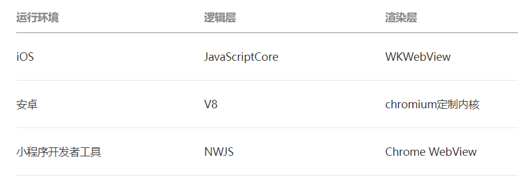
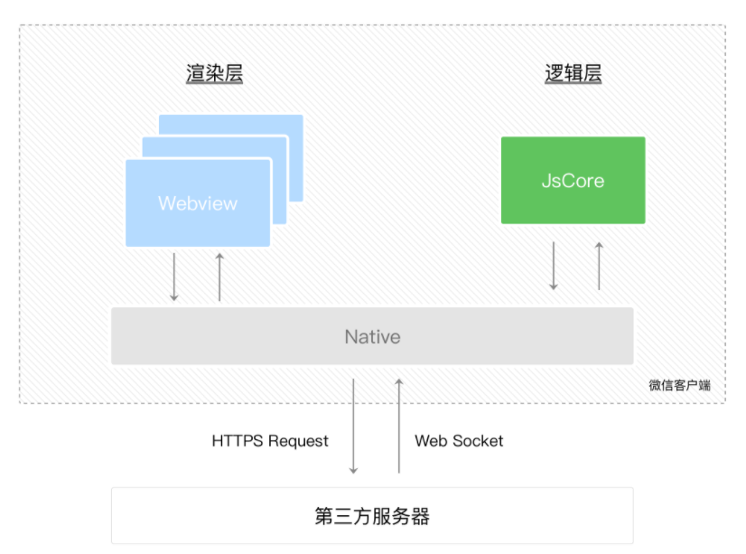

[TOC]

---


### 与网页开发的区别

* 线程

    * 网页中渲染线程与脚本线程互斥，这也是为什么长时间的脚本运行会使得页面失去响应；
    * 小程序分成多个线程。

* DOM

    * 网页中有DOM、BOM
    * 小程序中，渲染层与逻辑层是分开的，逻辑层运行在JSCore中，没有文档对象和浏览器对象。

* 环境

    * 网页需要面对的环境是PC端的多种浏览器、移动浏览器和各种webview；

    * 小程序需要面对的是环境是两个操作系统（Android、IOS）的微信客户端和微信开发者工具。

        


### 运行环境

微信小程序的运行环境分为两个部分：渲染层（view）和 逻辑层（app service）。其中 WXML、WXSS运行在渲染层；JavaScript运行在逻辑层。

* 渲染层：使用了webview进行渲染。一个小程序有多个界面，所以渲染层存在多个webview。
* 逻辑层：采用jsCore线程运行js脚本。

两个线程之间的通信经由微信客户端（即**Native**）做中转；逻辑层发送网络请求也经由Native转发。




### JSBridge

* 作用：构建native 和 非native之间的双向通信通道。
    * js向native发送消息：调用相关原生能力、通知native当前js的相关状态；
    * native向js发送消息：回溯调用结果、消息推送、通知js当前native的相关状态。
* 通信原理：
    * js向native：API注入 和 URL Schema。
        * native使用webview提供的接口，向js Context注入对象或者方法，使得js调用相关方法时，执行相应native逻辑；
        * js通过某种方式（比如ifram.src）发送url请求，native拦截到请求后，解析相关参数。（比较慢）。
    * native向js：native持有webview组件，通过它执行相应的逻辑即可。

```javascript
(function () {
    var id = 0, callbacks = {};

    window.JSBridge = {
        // 调用 Native
        invoke: function(bridgeName, callback, data) {
            // 判断环境，获取不同的 nativeBridge
            var thisId = id ++; // 获取唯一 id
            callbacks[thisId] = callback; // 存储 Callback
            nativeBridge.postMessage({
                bridgeName: bridgeName,
                data: data || {},
                callbackId: thisId // 传到 Native 端
            });
        },
        receiveMessage: function(msg) {
            var bridgeName = msg.bridgeName,
                data = msg.data || {},
                callbackId = msg.callbackId; // Native 将 callbackId 原封不动传回
            // 具体逻辑
            // bridgeName 和 callbackId 不会同时存在
            if (callbackId) {
                if (callbacks[callbackId]) { // 找到相应句柄
                    callbacks[callbackId](msg.data); // 执行调用
                }
            } elseif (bridgeName) {

            }
        }
    };
})();
```


