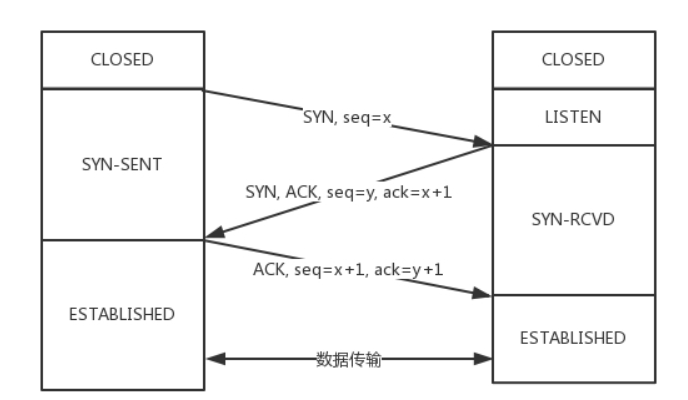
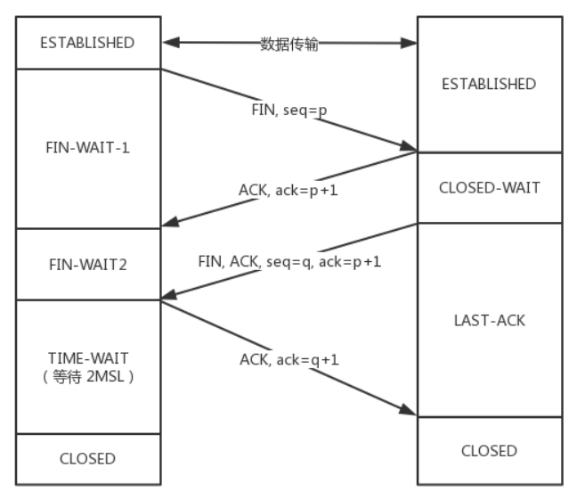
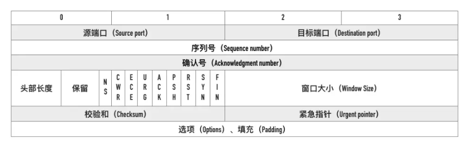

[TOC]

### 1. 与UDP的区别

基本区别：
> TCP 是一个**面向连接**的、**可靠**的、**基于字节流**的传输层协议；
>
> UDP是一个面向无连接的传输层协议。

* 面向连接：tcp在通信之前需要经过三次握手建立连接，udp不需要；
* 可靠：tcp的可靠性体现在两个方面：状态 和 可控制。UDP则没有这两个特性。
    * 状态：tcp会记录数据的接受情况，保证数据包有序接收
    * 可控制：丢包时，tcp会重传；网络状况不佳时，tcp会控制发送的速度
* 基于字节流：
    * udp的数据单位是用户数据包，仅仅是继承了ip层的特性；
    * tcp为了维护上述状态，将ip包转换成字节流传输。
* 一对一传输（单播）：udp还支持一对多，多对多。

> 但udp相比tcp，正因为没有上述的连接操作和可靠性保障，以及自身头部较小（8字节）等特点，使得它具有tcp所没有的 **高效性**，应用于诸如 **直播** 等场景。

### 2. TCP的三次握手

> 三次握手的过程：
>
> 

初始状态：客户端处于closed状态，服务器处于 listen 状态。

* 第一次握手：客户端发送SYN（和序列号seq），发起连接请求，进入SYN-SENT状态；
* 第二次握手：服务器接收请求，返回SYN和ACK，自身进入SYN-RCVD状态；
* 第三次握手：客户端接收请求，返回ACK，自身进入ESTABLISHED状态；服务器接收到后也进入ESTABLISHED状态。

> 为什么要第三次握手？
>
> 本质上是信道可靠问题，是一个要求通信双方对某一问题（在这里是建立连接）达成一致的理论上的**最小值**。那就只需解释为什么在两次握手之后，需要多出第三次。

​	**如果只有两次握手**：第一次握手发出的请求包可能**滞留**在网络中，而客户端由于**超时重传**又发出了一个包，如果两次握手即可建立连接，那么滞留包在到达服务器之后，服务器会建立起一个**无效的连接**，这也就造成了资源浪费。

### 3. TCP的四次挥手

> 过程拆解：
>
> 

初始状态：客户端和服务器都处于 ESTABLISHED状态。

* 第一次挥手：客户端向服务器发送 FIN 报文，请求关闭连接，而后进入半关闭（half-close）状态，即不能向服务器发送请求，只能接收；

* 第二次挥手：服务器接收到请求后，返回ACK，自身进入CLOSE-WAIT状态；等待数据传输完毕

* 第三次挥手：数据传输完毕后，服务器向客户端发送 FIN，自身进入 LAST-ACK状态；

* 第四次挥手：客户端接收到服务器发来的FIN之后，返回ACK，自身进入TIME-WAIT状态，等待2个MSL（maximum segment lifetime，最大报文存活时间）之后，进入CLOSED状态；服务器接收到ACK之后，也进入CLOSED状态。

> 为什么需要等待2个MSL？基于两个考虑

* 服务端是否还有数据包未到达？
* 自身发送的ACK报文是否已经被接收到？如果没接收到，要确保服务器端重传的FIN报文能到到。

> 为什么需要四次挥手？

服务器接收到FIN之后，不能马上返回FIN，必须确保数据传输完毕。因而多出一次挥手。

### 4.  半连接队列 和 SYN Flood

连接握手前，服务器由 closed 状态进入 listen状态时，会创建两个队列：半连接队列 和 全连接队列，又叫 SYN队列 和 Accept队列。

* 客户端的SYN连接请求到到服务器，服务器返回SYN和ACK，自身进入 SYN-RCVD状态，这个连接就被推入了SYN队列
* 三次握手完成后，连接在等待具体的应用取走之前，会被推入Accept队列。

SYN Flood属于典型的DDoS攻击（拒绝服务攻击）。原理是，通过在客户端伪造大量不存在的IP，想服务器发送SYN请求连接报文，服务器面临两个问题：

1. 处理这些请求，会有大量处于SYN-RCVD状态的连接，占满SYN队列；
2. 由于IP不存在，服务器一直接受不到响应的ACK报文，重发数据会消耗资源。

预防？

1. 提高SYN队列容量；
2. 降低重传次数；
3. 连接资源分配延后：客户端发回ack后再分配连接资源。

### 5.  TCP报文头部

* 源端口 + 目标端口（配合ip可以确定通信双方）
* 序列号：seq
    * 握手过程中交换初始序列号
    * 保证数据包按序号到达
* 确认号：
    * 告知下一个期望接收到的序列号
    * 同时表明小于当前确认号的所有字节已经接收到。

### 6.   TCP快速打开的原理

TFO（tcp fast open）：原理是首次握手的时候服务器发回一个Cooki，在后边的握手请求中携带上，服务器验证通过后，即可直接响应了（客户端还得继续返回ACK）。

### 7. TCP报文中时间戳的作用

* 计算往返时间RTT（rounding-trip time）
* 防止序号回绕问题：序号范围0~2^23 - 1，到了则返回0重新开始。序号即便相同了，时间戳也能做区分。

### 8. TCP的流量控制

> 首先需要理解**滑动窗口**。

TCP的滑动窗口分为：发送窗口 和 接收窗口。

* 发送窗口：记录着
    * 窗口大小 `SND.WND = 14`
    * 待确认序号：`SND.UNA = 27`
    * 下一次发送位置：`SND.NXT = 36`
* 接收窗口：记录着
    * 窗口大小：`REV.WND = 9`
    * 下一个接收的位置：`REV.NXT = 27`

大致流程：

* 握手时初始化双发窗口大小，比如200个字节。
* 发送方发送字节，比如100个，SND.NXT右移100个字节
* 接收方接收，处理接收到的字节。如果此时负荷过大，来不及处理完，比如剩下60个字节，此时接收窗口缩小60字节，并在返回中调整窗口大小告知发送方。
* 发送方接收返回，调整窗口大小。

### 9. 拥塞控制

> 拥塞窗口限制发送窗口的大小：发送窗口的大小 = min（拥塞窗口，接收窗口）

涉及到的算法为：

* 慢启动、

* 拥塞避免、

* 快速重传（三次ack则重传）
* 快速恢复（一半取值，线性增加）

