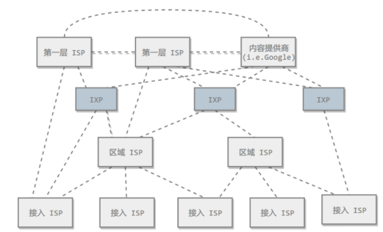

[TOC]

---

## 1. 概述

### ISP

### 主机之间的通信方式

C/S 和 P2P

### 电路交换和分组交换

### 时延

> 总时延 = 排队时延 + 处理时延 + 传输时延 + 传播时延

### 计算机网络体系结构

1. 五层协议
    * 应用层：
        * 为 **特定应用程序** 提供数据传输服务
        * 比如http、DNS等协议。
        * 数据单位：**报文**。
    * 传输层：
        * 为 **进程** 提供通用数据传输服务。
        * 包括两种协议：
            * TCP：传输控制协议，面向连接的、可靠的数据传输服务，数据单位为 **报文段**，只要提供 **完整性** 服务。
            * UDP：用户数据报协议，面向无连接的、尽最大努力的数据传输服务，数据单位为 **用户数据报**，主要提供 **及时性** 服务。
    * 网络层：
        * 为 **主机** 提供数据传输服务。
        * 协议比如：IP、ARP（ip -> mac）
        * 数据单位：**分组**。
    * 数据链路层：
        * 为 **同一链路的主机** 提供数据传输服务。（主机之间可以有很多链路）
        * 数据链路层把网络层传下来的分组封装成 **帧**。
    * 物理层：
        * 考虑如何在传输媒体上传输比特流（而不是具体的传输媒体）。
2. OSI（open system interconnection）
    * 表示层：数据压缩、加密、描述等格式问题
    * 会话层：会话管理。
3. TCP/IP
    * 相当于 数据链路层 和 物理层 合并为 网络接口层。
4. 数据在各层之间的传输
    * 向下逐步封装：添加下层协议所需的 首部 和 尾部
    * 向上逐渐解封：不断拆开 首部 和 尾部。
    * 路由器只有下三层协议，因为不需要为应用程序或进程提供服务。

## 2. 应用层

 

